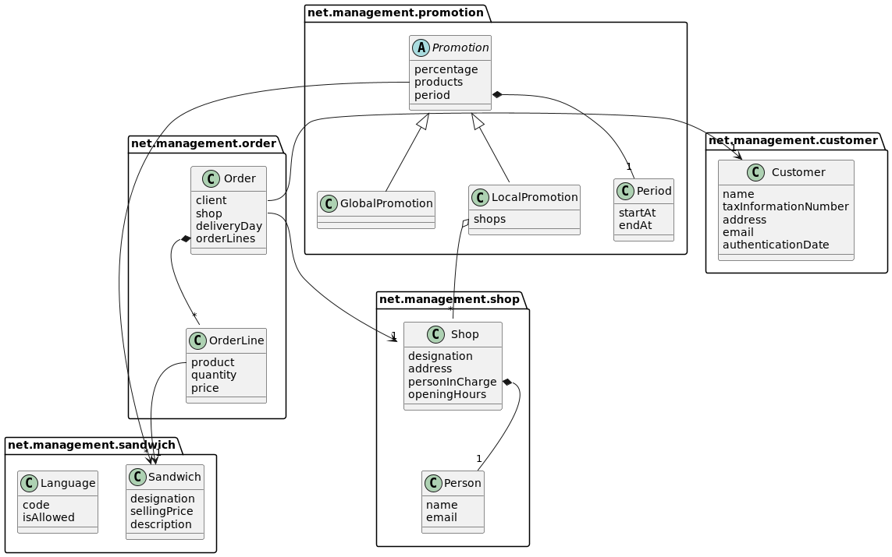
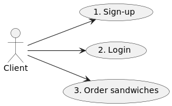
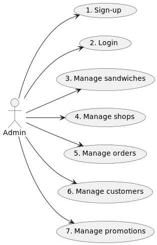

# GorgeousSandwich

This repository serves as a method of training and learning for software development. The content present in this
repository represents the author's thoughts on best practices in software engineering. The project was created as a part
of Master's Degree program.

The project is divided into two parts. The first part focuses on a monolithic architecture, with a majority of the
functionalities implemented. The second part of the project involves migrating the monolithic architecture to a
microservice architecture and implementing the remaining functionalities.

# Project statements

* [**Statement 1**](docs/statements/statement_1.md): Monolith
* [**Statement 2**](docs/statements/statement_2.md): Microservice

# Analysis and requirements

## Domain model

All the components in the domain model diagram as created based
at [Statement 1](docs/statements/statement_1.md#21-more-possible-architectural-drivers). The
names and properties were named respecting the Ubiquitous Language.

## Functional requirements

### Client

1. **Sign-up**: A **Client** insert his name, email and authentication data to perform a sign-up.
2. **Login**: A **Client** insert his email and authentication data to perform a login.
3. **Order sandwiches**: A **Client** register sandwiches and their quantities for delivery on a specific day and shop.
   The total price is informed. A sandwich can never be sold below zero, despite the promotions applied.

### Admin

No details are provided at [Statement 1](docs/statements/statement_1.md#21-more-possible-architectural-drivers)
regarding who manage each component. In order to simplify, an Admin actor is used as a super role that can manage all
components.

