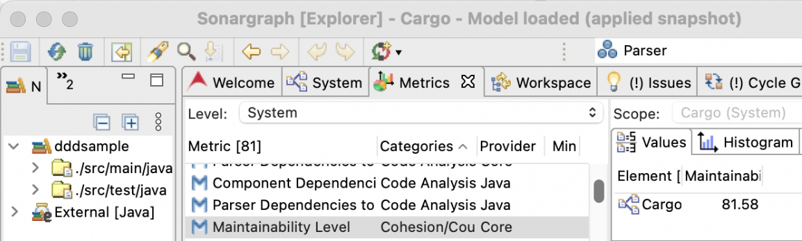

# 1 Context

## 1.1 Past

A very innovative organization that brings together many schools in Porto was concerned with the food available to its
academic community, especially its students, often displaced from their family’s homes, have few economic means, and do
not have the skills to prepare and cook healthy meals.

The institution stopped having vending machines that offered food of poor nutritional quality. Instead, affordable meals
began to be served in the canteen with delicious lunches and dinners due to a partnership with a famous hotel school and
the intense collaboration of its students enrolled in its Culinary Arts program.

The service received widespread national media coverage and later was expanded to include sandwiches. Great care has
gone into sandwiches to make them a delicious and fundamental contribution to a balanced life. In addition, the menu
included unusual sandwiches. Some examples are the Fruit Sando from Japan or the PB&J sandwich, among others.

It was a success. The sandwiches proved to be of great value, which led a former group of students, some of them with a
background in Computer Engineering, to start GorgeousSandwich, a company dedicated to healthy sandwiches in physical
stores.

# 1.2 Present

GorgeousSandwich has only one store but plans to expand soon. At least ten others are scheduled to open in the upcoming
months. In addition, a software engineering company, FoodSoftware, was hired to develop a new application that will make
some services available online.

There is some time to explore some possibilities in an on-prem prototype to be implemented before the final application.
Thefore, the prototype presentation must include the build and the execution at the command line, with instructions
available in the repository so that the process can be replicated by others who are not part of the current development
team.

# 2 More details

## 2.1 More possible architectural drivers

Some features are to be included in the prototype and then demonstrated:

1. Sandwich management: Each sandwich has a designation, a selling price, and multiple descriptions, although one per
   authorized language. The language is to be detected by the application. The allowed languages must be changed in a
   few seconds, but without impacting what was previously accepted. However, descriptions should never be removed.
2. Shop management: A shop has a designation, an address, a person in charge, and opening hours that may differ
   depending on the days of the week. The person in charge has a name and an email.
3. Order management: A client can register sandwiches and their quantities for delivery on a specific day and shop. The
   total price is informed by the prototype.
   Please note that a sandwich can never be sold below zero, despite the promotions applied.
4. Customer management: A customer has a name, a tax identification number, an address, an email and authentication
   data.
5. Promotions management : Global and local promotions can be specified. While global promotions apply to all stores,
   local promotion does not. Both types specify percentages that apply as a discount to the unit price of specific
   products and have a specified period for their application.
   Promotions are reflected in the price according to different possibilities: only the most favourable or local and
   global promotions are applied cumulatively. Switching from one possibility to another should be possible within
   seconds, without affecting what is finished.

However, it should be noted that, for the prototype, only insertions and listings are intended, with the specified
modification possibilities.

Users with different roles interact with the system prototype. It is up to the team their definition and consideration
in the application under development.

After a QAW, some potential architecture drivers and quality attribute scenarios were identified:

1. The prototype to be developed must be accessible using a web browser and it should be available in the next four
   weeks.
2. Authentication is needed for the prototype. It must ensure that 99% of unauthorized login attempts are detected. For
   the prototype, the team must explore a solution that prevents brute-force authentication attempts and comes as close
   as possible to the specified value. Authorization will be introduced later.
3. The FoodSoftware wants to start considering metrics to improve the codebase. At this moment, no more than 5 metrics
   should be used, but the focus should be on what can bring benefits. At least one is mandatory to explore, an
   experimental
   metric ([A Promising New Metric To Track Maintainability](https://blog.hello2morrow.com/2018/12/a-promising-new-metric-to-track-maintainability))
   to indicate the maintainability level of the application. The Sonargraph-Explorer tool is able to calculate it. The
   team has carried out some experiments with the tool and aims to reach a value of at least 70% (see Figure 2.1). Other
   applications can be considered for other maintainability metrics.
4. Testing on various quality dimensions is mandatory for the prototype, including the business rules captured in domain
   layers and what can ensure the correct functioning of the application and its API. More than the number of tests, it
   is important to explain and document what the tests allow to verify, regardless of the type of tests, together with
   the analysis of the prototype with inclusion in the repository of specific reports of the applications used.
   Tests must be used in the demonstration.
5. Only open-source tools and technologies are allowed, except those clearly mentioned in this document.
6. Although a distributed Microservices architecture is the target - not to be now addressed, the team needs to start
   with a Monolith with loose coupling between components.
7. Security issues in applications previously developed by the company highlight the need for careful design of what can
   have security implications. Thus, the team needs to think about some secure by design principles and threads to
   mitigate. Mention the rules described
   at [SEI. 20189](https://wiki.sei.cmu.edu/confluence/display/java/SEI+CERT+Oracle+Coding+Standard+for+Java) that were
   applied. Proper tools should be used.

Figure 2.1: An experiment with ML metric

Note: payment is not included in this initial experiment.

## 2.2 Documentation

### 2.2.1 Before starting or during design

During the design and for all iterations, progress must be tracked, including Kanban Design Boards, and sketches of
design views and decisions must be recorded. Consistency is valued for all artefacts.

Write down the responsibilities allocated to the various elements under consideration when creating the architectural
structures, and include them in the documentation of each iteration documentation. In summary, during the design
process, the following elements should be captured in a single document:

* The diagram(s) that represent(s)s the structure(s) produced,
* The element responsibilities table,
* The relevant design decisions, and their rationales.

Depending on the iteration purpose, other pieces of information might also be captured, such as:

* A runtime representation of the element’s interaction,
* The initial interface specifications (how elements interact with each other).

### 2.2.2 Architecture and prototype evaluation

The reports generated by specific tools are valuable documentation to be included in the team repository. They should be
used to support the prototype analysis. The design should be rethought, and all architecture approaches for specific
quality attribute concerns are to be re-examined. The team should review the existing and newly discovered risks and
tradeoffs and discuss them. A risk is defined as an architectural decision that may lead to undesirable consequences in
light of quality attribute requirements.

Alternatively, another approach can be used: a tactics-based questionnaire, one for each quality attribute under
consideration. It is considered an "(even lighter) lightweight evaluation method" (L. Bass, P. Clements, and R. Kazman.
2021. Software Architecture in Practice (4 ed.). Addison-Wesley Professional.). It aims to help in the analysis of what
was achieved by the team. It can be discussed by the team and fulfilled together.

For each question, the following information is to be recorded (L. Bass, P. Clements, and R. Kazman. 2021. Software
Architecture in Practice (4 ed.). Addison-Wesley Professional.):

* The tactic is addressed or not by indicating “Y” in the “Supported” column if the tactic is supported in the
  architecture and “N” otherwise.
* The anticipated/experienced difficulty or risk of implementing the tactic using the (H = high, M = medium, L = low)
  scale - the “Risk” column is to be used for this effect. For instance, a tactic that was of low difficulty or risk to
  implement would be labeled L (or which is anticipated to be of low difficulty, if it has not yet been implemented).
* If it has been used, record how it is realized in the system or will be (e.g., code developed by the team - which code
  modules, frameworks, or packages implement this tactic – or other people in the same organization, generic frameworks,
  or other externally produced components. The exact design decisions made to realize the tactic and where the
  realization is visible and can be checked - valuable for auditing purposes, among others.
* Any rationale or assumptions made in the realization of this tactic. In the “Rationale” column, describe the rationale
  for the design decisions made (including a decision to not use this tactic). State the implications of the decision (
  more effort, additional time needed, evolution).

The questionnaire need to be justified with adequate bibliographic support.

Other questionnaires may be needed and the following sources can be consulted for this purpose: (L. Bass, P. Clements,
and R. Kazman. 2021. Software Architecture in Practice (4 ed.). Addison-Wesley Professional.) and (H. Cervantes and R.
Kazman. 2016. Designing software architectures: a practical approach. Addison-Wesley Professional), among others.

# 3 Terms and conditions

## 3.1 Academic requirements and clarifications

* The architecture design method to be used is ADD 3.0 (H. Cervantes and R. Kazman. 2016. Designing software
  architectures: a practical
  approach. Addison-Wesley Professional). It is mandatory, also a DDD approach.
* Use UML 2.5 notation.
* A monolithic Springboot application must be developed. Java is the programming language to be used.
* The distribution of work must ensure that each member has analysis, design, implementation and testing activities,
  with their description included in the report.
* Groups with less than 5 elements are exempt from having authentication and language recognition in the prototype.

## 3.2 Process

The proposed process for this part includes some of the activities developed that are here described. They can be
developed sequentially, for example, one each week, but some can be developed in parallel. The team should organize and
divide the work as appropriate.

* **Activity 1:**
    * DDD (entity, value object, aggregate)
    * technological explorations
    * all architectural drivers
* **Activity 2:**
    * ADD (all iterations done)
    * development (work division, start of development)
* **Activity 3:**
    * Development
* **Activity 4:**
    * lightweight informal evaluation and/or tactics-based questionnaire(s)
    * prototype analysis: The prototype was developed with some objectives. Did it allow to understand the consequence
      of some decisions?
    * development conclusion and report

These activities must be documented and the resulting artifacts placed inside the repository (Markdown format) to allow
monitoring of the work whenever necessary or requested. However, the relevant parts must be aggregated in the final
report.
